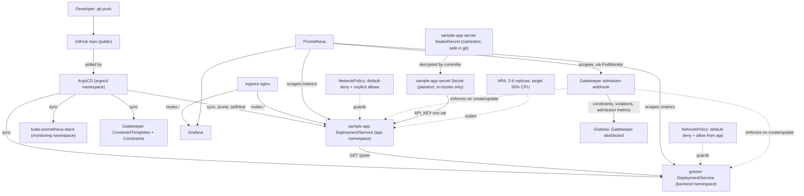

# minikube-gitops-platform

A local, single-cluster GitOps platform on minikube: ArgoCD manages two small Flask services and
a `kube-prometheus-stack` monitoring stack from this repo, using the app-of-apps pattern, with
Gatekeeper enforcing the security conventions the manifests already follow. It's meant as a
working demo of enterprise Kubernetes patterns (GitOps, observability, service-to-service traffic,
policy-as-code) scaled down to run on a laptop, not a production platform.

## Architecture



- **App-of-apps**: `gitops/root-app.yaml` is the one Application you apply by hand. It watches
  `gitops/apps/`, which declares six child Applications: `sample-app`, `greeter`,
  `kube-prometheus-stack` (upstream Helm chart + `monitoring/values.yaml` via multi-source),
  `tls` (cert-manager's ClusterIssuers + local CA), and `policy-templates` + `policy-constraints`
  (Gatekeeper, split into two Applications on purpose — see the comment in
  `gitops/apps/policy-constraints.yaml` for why). From that point on, `git push` is the only
  deployment step — ArgoCD polls this repo and reconciles the cluster automatically
  (`prune: true`, `selfHeal: true`).
- **sample-app** (`app/`): a small Flask app with `/health`, `/metrics`, `/`, and `/greeting`
  (calls `greeter` over HTTP and returns its response, or a `502` if it's unreachable).
- **greeter** (`greeter/`): a second small Flask app in its own `backend` namespace, with
  `/health`, `/metrics`, and `/greet`. Exists purely so there's real service-to-service traffic
  in the cluster, gated by an actual NetworkPolicy rather than everything living in one flat
  namespace. Both apps run as non-root, read-only root filesystem, with resource
  requests/limits and liveness/readiness probes.
- **Monitoring**: `kube-prometheus-stack` (Prometheus + Grafana + Alertmanager), trimmed to a
  small footprint for local use, with `ServiceMonitor`s scraping both apps' `/metrics`.
- **Ingress + TLS**: `ingress-nginx` (minikube addon) routes `sample-app.local` to the app and
  `grafana.local` to Grafana, both over real TLS. `cert-manager` (`gitops/tls/`) bootstraps a
  local CA (`selfsigned-issuer` → `local-ca` Certificate → `ca-issuer` ClusterIssuer) and issues
  a leaf certificate per host via the `cert-manager.io/cluster-issuer` annotation on each
  Ingress. It's a real cert chain — `curl --cacert` against the CA cert verifies clean — just not
  a publicly-trusted one, so browsers will still warn unless you import it. `greeter` has no
  ingress — it's internal-only.
- **Network policy**: default-deny ingress in both `app` and `backend` namespaces. `app` allows
  traffic from `ingress-nginx` (user traffic) and `monitoring` (scraping). `backend` allows
  traffic only from the `app` namespace and `monitoring` — nothing outside the cluster, and
  nothing outside `app`, can reach `greeter` directly.
- **Policy-as-code**: Gatekeeper (`gitops/policies/`) enforces at admission time what the
  manifests already do by convention — non-root, no privilege escalation, resource
  requests/limits required, no `:latest` image tags — scoped to the `app` and `backend`
  namespaces only, so it can't break the upstream charts running elsewhere in the cluster.
  A `PodMonitor` scrapes both Gatekeeper pods directly (there's no dedicated metrics Service,
  only the webhook one) and a Grafana dashboard (`gitops/policies/constraints/grafana-dashboard.yaml`)
  shows active constraints/templates, current audit violations, and admission request
  rate/latency by allow/deny outcome — real metrics, not a static count.
- **Secrets management**: `sealed-secrets` (installed by `bootstrap.sh`, not GitOps-managed —
  same reasoning as ArgoCD/Gatekeeper/cert-manager) lets `gitops/sample-app/sealed-secret.yaml`
  be committed to git as ciphertext, decryptable only by the controller running in this specific
  cluster. `sample-app` mounts the resulting Secret as `API_KEY` and reports
  `api_key_configured: true` on `/health` — never the value itself — to prove it was actually
  decrypted and wired up correctly, not just declared. See `scripts/reseal-demo-secret.sh` and
  the "Rotate or re-seal" section below for the operational catch: the sealing key must survive
  cluster rebuilds or every committed SealedSecret becomes permanently undecryptable.
- **Autoscaling**: a `HorizontalPodAutoscaler` (`gitops/sample-app/hpa.yaml`) keeps `sample-app`
  between 2 and 6 replicas, targeting 50% CPU utilization via `metrics-server` (a minikube
  addon). `gitops/apps/sample-app.yaml` sets `ignoreDifferences` on `spec.replicas` — without it,
  ArgoCD's `selfHeal` fights the HPA and resets replicas back to the git-declared value every
  reconcile, silently undoing every scale-up. `scripts/load-test.sh` generates real load
  in-cluster and watches it actually scale.

## Prerequisites

`minikube`, `kubectl`, `helm`, `docker`, `jq`. Tested with minikube v1.36, kubectl v1.33,
helm v3.18, Docker 27. `kubeseal` is only needed if you want to rotate the demo secret (see
below) — `brew install kubeseal` or see [its releases](https://github.com/bitnami-labs/sealed-secrets/releases).

## How to run this

```bash
git clone https://github.com/soodrajesh/minikube-gitops-platform.git
cd minikube-gitops-platform

./scripts/bootstrap.sh   # starts minikube, enables ingress/metrics-server,
                          # builds both app images into minikube's docker daemon,
                          # installs ArgoCD, Gatekeeper, cert-manager, and
                          # sealed-secrets via Helm

./scripts/deploy.sh      # applies the root Application, waits for everything
                          # to reach Synced + Healthy

./scripts/test.sh        # smoke tests: curl the app through ingress over TLS
                          # (verified against the local CA), check the
                          # Prometheus target is up, check Grafana health over
                          # TLS too, confirm the NetworkPolicies are applied,
                          # confirm Gatekeeper blocks a non-compliant pod,
                          # confirm the HPA has a real metric

./scripts/load-test.sh   # generates real load in-cluster and watches the
                          # HPA actually scale sample-app up (optional --
                          # not part of the standard test.sh checks, takes
                          # ~2 minutes)
```

On macOS/Windows with the Docker driver, `minikube ip` isn't directly routable from the host, so
`scripts/test.sh` reaches the app and Grafana through `kubectl port-forward svc/ingress-nginx-controller`
instead. To browse interactively yourself (ingress now redirects plain HTTP to HTTPS, so this
needs the CA cert to verify clean):

```bash
kubectl get secret local-ca-secret -n cert-manager -o jsonpath='{.data.ca\.crt}' | base64 -d > /tmp/local-ca.crt
kubectl -n ingress-nginx port-forward svc/ingress-nginx-controller 8443:443
curl --cacert /tmp/local-ca.crt --resolve sample-app.local:8443:127.0.0.1 https://sample-app.local:8443/
```

(On Linux with the Docker driver, or any OS with the `--driver=none`/`hyperkit`/`kvm2` drivers,
`minikube ip` is directly routable and you can add it to `/etc/hosts` instead:
`<minikube ip>  sample-app.local grafana.local`, then `curl --cacert /tmp/local-ca.crt
https://sample-app.local/`. To browse in an actual browser without a cert warning, import
`/tmp/local-ca.crt` into your OS/browser trust store as a CA.)

Grafana's admin password is auto-generated by the Helm chart, not hardcoded:

```bash
kubectl get secret -n monitoring kube-prometheus-stack-grafana \
  -o jsonpath="{.data.admin-password}" | base64 -d
```

ArgoCD's initial admin password is printed at the end of `bootstrap.sh`, or fetch it again with:

```bash
kubectl -n argocd get secret argocd-initial-admin-secret \
  -o jsonpath="{.data.password}" | base64 -d
```

`gitops/sample-app/sealed-secret.yaml` was sealed against the maintainer's own cluster's key —
`bootstrap.sh` backs that key up to `~/.minikube-gitops-platform/sealed-secrets-key.yaml` and
restores it on every future bootstrap, so it stays decryptable across `minikube delete` cycles
*on that machine*. If you're running this on a different machine (no matching key backup) or
just want to rotate the demo value:

```bash
./scripts/reseal-demo-secret.sh "some-new-value"   # writes a fresh gitops/sample-app/sealed-secret.yaml
git add gitops/sample-app/sealed-secret.yaml && git commit -m "rotate demo secret" && git push
```

Tear down when done:

```bash
./scripts/teardown.sh    # asks for confirmation, then `minikube delete`
```

## Project structure

```
.
├── app/                        # Flask sample app: /, /health, /metrics, /greeting -> greeter
│   ├── app.py
│   ├── Dockerfile               # non-root user, HEALTHCHECK, gunicorn
│   ├── requirements.txt
│   └── tests/test_app.py
├── greeter/                    # Flask backend app: /health, /metrics, /greet
│   ├── app.py
│   ├── Dockerfile
│   ├── requirements.txt
│   └── tests/test_app.py
├── gitops/
│   ├── root-app.yaml            # the one Application you apply by hand (app-of-apps root)
│   ├── apps/
│   │   ├── sample-app.yaml      # Application CR -> gitops/sample-app/
│   │   ├── greeter.yaml         # Application CR -> gitops/greeter/
│   │   ├── monitoring.yaml      # Application CR -> kube-prometheus-stack chart + monitoring/values.yaml
│   │   ├── tls.yaml              # Application CR -> gitops/tls/
│   │   ├── policy-templates.yaml    # Application CR -> gitops/policies/templates/
│   │   └── policy-constraints.yaml  # Application CR -> gitops/policies/constraints/
│   ├── sample-app/               # plain k8s manifests for sample-app
│   │   ├── deployment.yaml        # includes API_KEY from the SealedSecret below
│   │   ├── service.yaml
│   │   ├── ingress.yaml           # TLS via cert-manager.io/cluster-issuer annotation
│   │   ├── networkpolicy.yaml
│   │   ├── hpa.yaml                # 2-6 replicas, target 50% CPU
│   │   └── sealed-secret.yaml     # ciphertext, safe to commit -- see scripts/reseal-demo-secret.sh
│   ├── greeter/                  # plain k8s manifests for greeter
│   │   ├── deployment.yaml
│   │   ├── service.yaml
│   │   └── networkpolicy.yaml
│   ├── policies/                 # Gatekeeper ConstraintTemplates + Constraints
│   │   ├── templates/            # synced by the policy-templates Application
│   │   └── constraints/          # synced by the policy-constraints Application (after
│   │       │                      # policy-templates' CRDs exist -- see that Application's comment)
│   │       ├── podmonitor.yaml         # scrapes both Gatekeeper pods directly
│   │       └── grafana-dashboard.yaml  # constraints, violations, admission request rate/latency
│   └── tls/                      # cert-manager: local CA bootstrap + issuer
│       ├── selfsigned-issuer.yaml
│       ├── ca-certificate.yaml
│       └── ca-issuer.yaml
├── monitoring/
│   └── values.yaml               # kube-prometheus-stack values (lean footprint, both apps'
│                                  # ServiceMonitors, Grafana ingress TLS)
├── scripts/
│   ├── bootstrap.sh
│   ├── deploy.sh
│   ├── test.sh
│   ├── teardown.sh
│   ├── reseal-demo-secret.sh     # regenerate gitops/sample-app/sealed-secret.yaml
│   └── load-test.sh              # generate load in-cluster, watch the HPA scale
└── .github/workflows/ci.yml     # pytest x2, docker build + Trivy scan x2, kubeconform + yamllint,
                                   # e2e-smoke-test (kind cluster)
```

## CI

On every PR: run both apps' pytest suites, build both Docker images and scan them with Trivy
(fails on HIGH/CRITICAL fixable vulnerabilities), lint the plain k8s manifests with
`kubeconform -strict` (Gatekeeper's custom CRD kinds are checked for valid YAML/structure only,
since there's no public schema for kubeconform to validate them against), and `yamllint` the
YAML across the repo.

CI also stands up a real (scaled-down) cluster: the `e2e-smoke-test` job creates a `kind`
cluster, installs Gatekeeper, cert-manager, and sealed-secrets, applies `gitops/sample-app`,
`gitops/greeter`, `gitops/policies`, and `gitops/tls` directly via `kubectl apply`, then verifies
the app actually serves traffic, successfully calls `greeter` across namespaces, decrypted its
Secret correctly, and that Gatekeeper actually rejects a non-compliant pod. This is deliberately
narrower than what `scripts/deploy.sh` does locally — it applies manifests directly rather than
through ArgoCD (getting ArgoCD to sync against a PR's exact commit rather than `main` needs more
infrastructure than is worth it for a CI job), skips `kube-prometheus-stack`/`ingress-nginx`
entirely to stay within a GitHub-hosted runner's resources, and creates the demo Secret directly
rather than relying on the committed `sealed-secret.yaml` (which is sealed against the
maintainer's own cluster and, by design, can never decrypt anywhere else — see the job's comments
for why that's expected, not a bug). The HPA applies cleanly in CI too, but `kind` doesn't ship
`metrics-server` by default and CI doesn't install one, so its metric stays `<unknown>` there —
actual autoscaling is only exercised by `scripts/load-test.sh` against the local minikube
cluster. See `.github/workflows/ci.yml` for the full reasoning. The ArgoCD sync path and the
full monitoring stack are only exercised by running `scripts/deploy.sh` and `scripts/test.sh`
locally.

## What's missing

This is a single-cluster local demo, not a production platform:

- No multi-cluster / dev-staging-prod separation — "environment" here is just this one
  minikube cluster.
- No real DNS or publicly-trusted TLS — ingress hosts are `*.local` names resolved via
  `/etc/hosts`, and cert-manager's CA is self-signed locally (see the Architecture section
  above), not from a real certificate authority. cert-manager itself and the cert chain it
  issues are real, working machinery — just not backed by a CA anyone outside this cluster
  would trust.
- Sealed Secrets is included and demonstrated (`gitops/sample-app/sealed-secret.yaml`), but it
  only solves "safe to commit to git" — the resulting plaintext Secret is still an ordinary
  Kubernetes Secret once decrypted (base64 in etcd, not encrypted at rest by default). A real
  deployment would add etcd encryption at rest and/or move to External Secrets/Vault for
  dynamic secrets, rotation, and audit logging, none of which is here.
- No service mesh (Istio/Linkerd) — deliberately left out to keep the resource footprint small
  on a 16GB laptop. Gatekeeper is included, but scoped to only the `app`/`backend` namespaces —
  the upstream ArgoCD/monitoring charts running elsewhere aren't policed by it, since they
  weren't written to these conventions and enforcing it there would break them at admission
  time. This also means Gatekeeper only catches violations in *new* pods going forward; it
  doesn't retroactively audit-and-reject what was already running before a constraint was added.
- CI's `e2e-smoke-test` applies manifests directly and runs on a `kind` cluster, not against
  ArgoCD or minikube — it doesn't test the actual GitOps sync path (app-of-apps discovery, the
  ServerSideApply/CRD ordering issues documented in RUNBOOK.md, `kube-prometheus-stack`). Those
  are only exercised by running `scripts/deploy.sh` and `scripts/test.sh` locally.
- `sample-app`'s CPU request (50m) is sized too low relative to its actual idle baseline
  (gunicorn + Flask + `prometheus_client` overhead, plus liveness/readiness probes and
  Prometheus scraping every ~10-15s) — running `scripts/load-test.sh` showed the HPA metric
  hovering near or above the 50% target even shortly after load stops, so scale-down is slower
  than you'd expect from the `stabilizationWindowSeconds: 60` alone. Sizing requests from real
  idle measurements (`kubectl top pods`) rather than a round-number guess would fix this; left
  as-is here because it's a realistic thing to hit and worth seeing, not because it's correct.

See [SECURITY.md](SECURITY.md) for the full list of what's implemented vs. aspirational.
