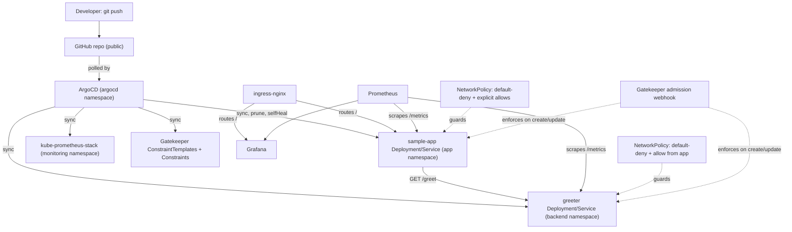

# minikube-gitops-platform

A local, single-cluster GitOps platform on minikube: ArgoCD manages two small Flask services and
a `kube-prometheus-stack` monitoring stack from this repo, using the app-of-apps pattern, with
Gatekeeper enforcing the security conventions the manifests already follow. It's meant as a
working demo of enterprise Kubernetes patterns (GitOps, observability, service-to-service traffic,
policy-as-code) scaled down to run on a laptop, not a production platform.

## Architecture



- **App-of-apps**: `gitops/root-app.yaml` is the one Application you apply by hand. It watches
  `gitops/apps/`, which declares five child Applications: `sample-app`, `greeter`,
  `kube-prometheus-stack` (upstream Helm chart + `monitoring/values.yaml` via multi-source), and
  `policy-templates` + `policy-constraints` (Gatekeeper, split into two Applications on purpose —
  see the comment in `gitops/apps/policy-constraints.yaml` for why). From that point on,
  `git push` is the only deployment step — ArgoCD polls this repo and reconciles the cluster
  automatically
  (`prune: true`, `selfHeal: true`).
- **sample-app** (`app/`): a small Flask app with `/health`, `/metrics`, `/`, and `/greeting`
  (calls `greeter` over HTTP and returns its response, or a `502` if it's unreachable).
- **greeter** (`greeter/`): a second small Flask app in its own `backend` namespace, with
  `/health`, `/metrics`, and `/greet`. Exists purely so there's real service-to-service traffic
  in the cluster, gated by an actual NetworkPolicy rather than everything living in one flat
  namespace. Both apps run as non-root, read-only root filesystem, with resource
  requests/limits and liveness/readiness probes.
- **Monitoring**: `kube-prometheus-stack` (Prometheus + Grafana + Alertmanager), trimmed to a
  small footprint for local use, with `ServiceMonitor`s scraping both apps' `/metrics`.
- **Ingress**: `ingress-nginx` (minikube addon) routes `sample-app.local` to the app and
  `grafana.local` to Grafana. `greeter` has no ingress — it's internal-only.
- **Network policy**: default-deny ingress in both `app` and `backend` namespaces. `app` allows
  traffic from `ingress-nginx` (user traffic) and `monitoring` (scraping). `backend` allows
  traffic only from the `app` namespace and `monitoring` — nothing outside the cluster, and
  nothing outside `app`, can reach `greeter` directly.
- **Policy-as-code**: Gatekeeper (`gitops/policies/`) enforces at admission time what the
  manifests already do by convention — non-root, no privilege escalation, resource
  requests/limits required, no `:latest` image tags — scoped to the `app` and `backend`
  namespaces only, so it can't break the upstream charts running elsewhere in the cluster.

## Prerequisites

`minikube`, `kubectl`, `helm`, `docker`, `jq`. Tested with minikube v1.36, kubectl v1.33,
helm v3.18, Docker 27.

## How to run this

```bash
git clone https://github.com/soodrajesh/minikube-gitops-platform.git
cd minikube-gitops-platform

./scripts/bootstrap.sh   # starts minikube, enables ingress/metrics-server,
                          # builds both app images into minikube's docker daemon,
                          # installs ArgoCD and Gatekeeper via Helm

./scripts/deploy.sh      # applies the root Application, waits for everything
                          # to reach Synced + Healthy

./scripts/test.sh        # smoke tests: curl the app through ingress, check
                          # the Prometheus target is up, check Grafana health,
                          # confirm the NetworkPolicy is applied
```

On macOS/Windows with the Docker driver, `minikube ip` isn't directly routable from the host, so
`scripts/test.sh` reaches the app and Grafana through `kubectl port-forward svc/ingress-nginx-controller`
instead. To browse interactively yourself:

```bash
kubectl -n ingress-nginx port-forward svc/ingress-nginx-controller 8888:80
curl -H "Host: sample-app.local" http://localhost:8888/
```

(On Linux with the Docker driver, or any OS with the `--driver=none`/`hyperkit`/`kvm2` drivers,
`minikube ip` is directly routable and you can add it to `/etc/hosts` instead:
`<minikube ip>  sample-app.local grafana.local`.)

Grafana's admin password is auto-generated by the Helm chart, not hardcoded:

```bash
kubectl get secret -n monitoring kube-prometheus-stack-grafana \
  -o jsonpath="{.data.admin-password}" | base64 -d
```

ArgoCD's initial admin password is printed at the end of `bootstrap.sh`, or fetch it again with:

```bash
kubectl -n argocd get secret argocd-initial-admin-secret \
  -o jsonpath="{.data.password}" | base64 -d
```

Tear down when done:

```bash
./scripts/teardown.sh    # asks for confirmation, then `minikube delete`
```

## Project structure

```
.
├── app/                        # Flask sample app: /, /health, /metrics, /greeting -> greeter
│   ├── app.py
│   ├── Dockerfile               # non-root user, HEALTHCHECK, gunicorn
│   ├── requirements.txt
│   └── tests/test_app.py
├── greeter/                    # Flask backend app: /health, /metrics, /greet
│   ├── app.py
│   ├── Dockerfile
│   ├── requirements.txt
│   └── tests/test_app.py
├── gitops/
│   ├── root-app.yaml            # the one Application you apply by hand (app-of-apps root)
│   ├── apps/
│   │   ├── sample-app.yaml      # Application CR -> gitops/sample-app/
│   │   ├── greeter.yaml         # Application CR -> gitops/greeter/
│   │   ├── monitoring.yaml      # Application CR -> kube-prometheus-stack chart + monitoring/values.yaml
│   │   ├── policy-templates.yaml    # Application CR -> gitops/policies/templates/
│   │   └── policy-constraints.yaml  # Application CR -> gitops/policies/constraints/
│   ├── sample-app/               # plain k8s manifests for sample-app
│   │   ├── deployment.yaml
│   │   ├── service.yaml
│   │   ├── ingress.yaml
│   │   └── networkpolicy.yaml
│   ├── greeter/                  # plain k8s manifests for greeter
│   │   ├── deployment.yaml
│   │   ├── service.yaml
│   │   └── networkpolicy.yaml
│   └── policies/                 # Gatekeeper ConstraintTemplates + Constraints
│       ├── templates/            # synced by the policy-templates Application
│       └── constraints/          # synced by the policy-constraints Application (after
│                                  # policy-templates' CRDs exist -- see that Application's comment)
├── monitoring/
│   └── values.yaml               # kube-prometheus-stack values (lean footprint + both apps' ServiceMonitors)
├── scripts/
│   ├── bootstrap.sh
│   ├── deploy.sh
│   ├── test.sh
│   └── teardown.sh
└── .github/workflows/ci.yml     # pytest x2, docker build + Trivy scan x2, kubeconform + yamllint
```

## CI

On every PR: run both apps' pytest suites, build both Docker images and scan them with Trivy
(fails on HIGH/CRITICAL fixable vulnerabilities), lint the plain k8s manifests with
`kubeconform -strict` (Gatekeeper's custom CRD kinds are checked for valid YAML/structure only,
since there's no public schema for kubeconform to validate them against), and `yamllint` the
YAML across the repo. CI does not stand up a cluster — it validates the apps and the manifests,
not a live deployment.

## What's missing

This is a single-cluster local demo, not a production platform:

- No multi-cluster / dev-staging-prod separation — "environment" here is just this one
  minikube cluster.
- No real TLS or DNS — ingress hosts are `*.local` names resolved via `/etc/hosts`, no
  cert-manager.
- No secrets management beyond Kubernetes' built-in Secrets (which are base64, not encrypted
  at rest by default). A real deployment would add Sealed Secrets, External Secrets, or Vault.
- No service mesh (Istio/Linkerd) — deliberately left out to keep the resource footprint small
  on a 16GB laptop. Gatekeeper is included, but scoped to only the `app`/`backend` namespaces —
  the upstream ArgoCD/monitoring charts running elsewhere aren't policed by it, since they
  weren't written to these conventions and enforcing it there would break them at admission
  time. This also means Gatekeeper only catches violations in *new* pods going forward; it
  doesn't retroactively audit-and-reject what was already running before a constraint was added.
- CI doesn't spin up a cluster to test the actual ArgoCD sync — it validates manifests
  statically. The full sync path is only exercised by running `scripts/deploy.sh` locally.

See [SECURITY.md](SECURITY.md) for the full list of what's implemented vs. aspirational.
