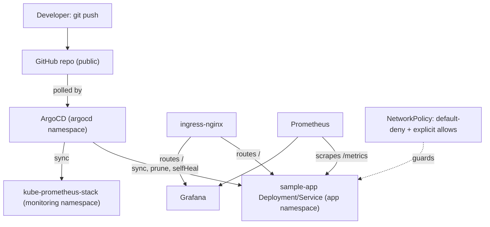

# minikube-gitops-platform

A local, single-cluster GitOps platform on minikube: ArgoCD manages a sample Flask app and a
`kube-prometheus-stack` monitoring stack from this repo, using the app-of-apps pattern. It's
meant as a working demo of enterprise Kubernetes patterns (GitOps, observability, basic pod
security and network policy) scaled down to run on a laptop, not a production platform.

## Architecture



- **App-of-apps**: `gitops/root-app.yaml` is the one Application you apply by hand. It watches
  `gitops/apps/`, which declares two child Applications: `sample-app` (plain manifests in
  `gitops/sample-app/`) and `kube-prometheus-stack` (the upstream Helm chart, with
  `monitoring/values.yaml` from this repo layered on top via ArgoCD's multi-source support).
  From that point on, `git push` is the only deployment step — ArgoCD polls this repo and
  reconciles the cluster automatically (`prune: true`, `selfHeal: true`).
- **sample-app** (`app/`): a small Flask app with `/health`, `/metrics` (Prometheus format via
  `prometheus_client`), and `/`. Runs as a non-root user, read-only root filesystem, with
  resource requests/limits and liveness/readiness probes.
- **Monitoring**: `kube-prometheus-stack` (Prometheus + Grafana + Alertmanager), trimmed to a
  small footprint for local use, with a `ServiceMonitor` scraping the app's `/metrics`.
- **Ingress**: `ingress-nginx` (minikube addon) routes `sample-app.local` to the app and
  `grafana.local` to Grafana.
- **Network policy**: default-deny ingress in the `app` namespace, with explicit allows from
  `ingress-nginx` (for user traffic) and `monitoring` (for Prometheus scraping).

## Prerequisites

`minikube`, `kubectl`, `helm`, `docker`, `jq`. Tested with minikube v1.36, kubectl v1.33,
helm v3.18, Docker 27.

## How to run this

```bash
git clone https://github.com/soodrajesh/minikube-gitops-platform.git
cd minikube-gitops-platform

./scripts/bootstrap.sh   # starts minikube, enables ingress/metrics-server,
                          # builds the app image into minikube's docker daemon,
                          # installs ArgoCD via Helm

./scripts/deploy.sh      # applies the root Application, waits for everything
                          # to reach Synced + Healthy

./scripts/test.sh        # smoke tests: curl the app through ingress, check
                          # the Prometheus target is up, check Grafana health,
                          # confirm the NetworkPolicy is applied
```

Add these to `/etc/hosts` (using `minikube ip`) if you want to browse the UIs directly instead
of via `curl -H "Host: ..."`:

```
<minikube ip>  sample-app.local grafana.local
```

Grafana's admin password is auto-generated by the Helm chart, not hardcoded:

```bash
kubectl get secret -n monitoring kube-prometheus-stack-grafana \
  -o jsonpath="{.data.admin-password}" | base64 -d
```

ArgoCD's initial admin password is printed at the end of `bootstrap.sh`, or fetch it again with:

```bash
kubectl -n argocd get secret argocd-initial-admin-secret \
  -o jsonpath="{.data.password}" | base64 -d
```

Tear down when done:

```bash
./scripts/teardown.sh    # asks for confirmation, then `minikube delete`
```

## Project structure

```
.
├── app/                        # Flask sample app: /, /health, /metrics
│   ├── app.py
│   ├── Dockerfile               # non-root user, HEALTHCHECK, gunicorn
│   ├── requirements.txt
│   └── tests/test_app.py
├── gitops/
│   ├── root-app.yaml            # the one Application you apply by hand (app-of-apps root)
│   ├── apps/
│   │   ├── sample-app.yaml      # Application CR -> gitops/sample-app/
│   │   └── monitoring.yaml      # Application CR -> kube-prometheus-stack chart + monitoring/values.yaml
│   └── sample-app/               # plain k8s manifests for the app
│       ├── deployment.yaml
│       ├── service.yaml
│       ├── ingress.yaml
│       └── networkpolicy.yaml
├── monitoring/
│   └── values.yaml               # kube-prometheus-stack values (lean footprint + app ServiceMonitor)
├── scripts/
│   ├── bootstrap.sh
│   ├── deploy.sh
│   ├── test.sh
│   └── teardown.sh
└── .github/workflows/ci.yml     # pytest, docker build + Trivy scan, kubeconform + yamllint
```

## CI

On every PR: run the app's pytest suite, build the Docker image and scan it with Trivy
(fails on HIGH/CRITICAL fixable vulnerabilities), lint the plain k8s manifests with
`kubeconform -strict`, and `yamllint` the YAML across the repo. CI does not stand up a cluster —
it validates the app and the manifests, not a live deployment.

## What's missing

This is a single-cluster local demo, not a production platform:

- No multi-cluster / dev-staging-prod separation — "environment" here is just this one
  minikube cluster.
- No real TLS or DNS — ingress hosts are `*.local` names resolved via `/etc/hosts`, no
  cert-manager.
- No secrets management beyond Kubernetes' built-in Secrets (which are base64, not encrypted
  at rest by default). A real deployment would add Sealed Secrets, External Secrets, or Vault.
- No policy engine (OPA/Gatekeeper) or service mesh (Istio) — deliberately left out to keep the
  resource footprint small on a 16GB laptop. The security controls that are in place
  (non-root containers, read-only rootfs, NetworkPolicy, resource limits, Trivy scanning) are
  real and enforced, just not backed by an admission-control policy engine.
- CI doesn't spin up a cluster to test the actual ArgoCD sync — it validates manifests
  statically. The full sync path is only exercised by running `scripts/deploy.sh` locally.

See [SECURITY.md](SECURITY.md) for the full list of what's implemented vs. aspirational.
